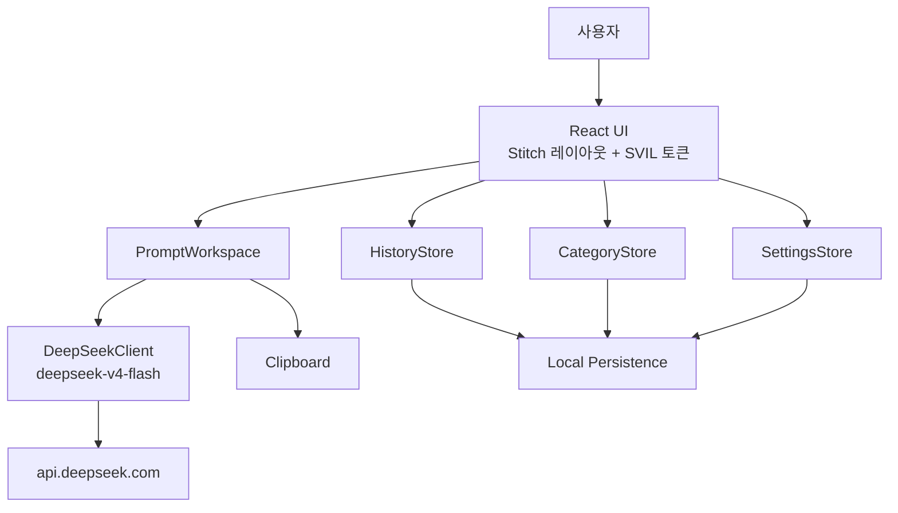
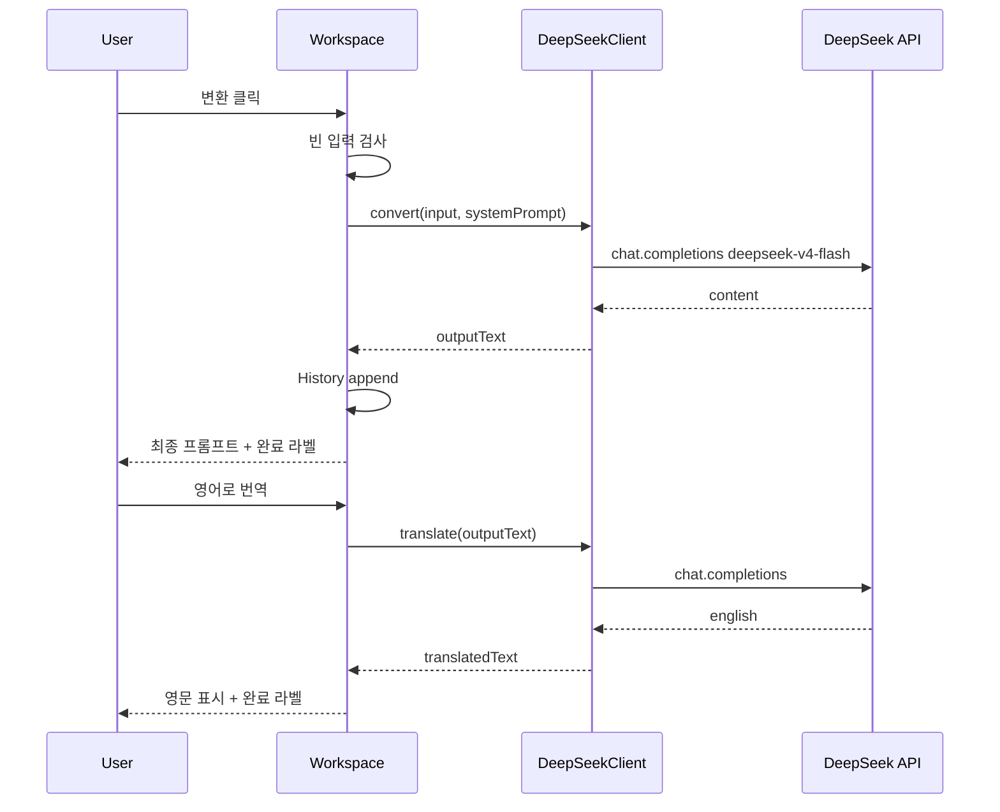

# Promfter Maker 아키텍처

작성일: 2026-07-14  
기준 버전: v0.3

---

## 01. 개요

Promfter Maker는 **로컬 우선 단일 페이지 앱**이다. UI는 Stitch 시안 레이아웃을 따르고, 변환·번역은 **DeepSeek V4 Flash** 원격 API를 호출하며, 카테고리·히스토리·설정은 **브라우저/데스크톱 로컬 저장소**에 둔다.

---

## 02. 구성도



---

## 03. 프론트엔드

| 모듈 | 책임 |
|---|---|
| `App` / 레이아웃 | 사이드·헤더·메인 컬럼 (Stitch) |
| `CategoryTabs` | 탭·추가·삭제 |
| `PromptInput` | 입력 |
| `ConvertButton` | 변환 트리거·상태 라벨 |
| `FinalPrompt` | 결과 표시·편집 |
| `ActionBar` | 복사·영문 번역 |
| `HistoryList` | 목록·제목 편집·복원 |
| `SettingsModal` | 글꼴·크기·언어·API 키 |
| `theme/tokens.css` | SVIL CSS 변수 |
| `i18n/` | 5개 언어 사전 |

스타일: 하드코딩 색 금지 · 토큰만. 폰트 로컬 `@font-face`.

---

## 04. LLM 연동



- 실패 시 기존 `outputText`/`translatedText` 유지  
- 모델 ID를 히스토리에 기록

---

## 05. 데이터 저장소

| 저장소 | 용도 |
|---|---|
| localStorage | 설정·카테고리·히스토리(소량) |
| IndexedDB (후속) | 히스토리 대량 시 |
| 환경 변수 / 로컬 시크릿 | API 키 |

동기화 서버 없음.

---

## 06. 인증 · 권한

- 앱 로그인 없음  
- DeepSeek Bearer 토큰만 사용  
- UI에서 키 마스킹 · 내보내기 JSON에 키 제외

---

## 07. 배포 · 운영

| 단계 | 방식 |
|---|---|
| 개발 | `vite` 로컬 |
| 배포(웹) | 정적 호스팅 가능 |
| 배포(데스크톱) | Electron/Tauri 패키징 (후속) |

운영 URL: 미정 · 현재 로컬만.

---

## 08. 보안 · 접근성

- API 키 평문 커밋 금지 · `.env` gitignore  
- HTTPS로 DeepSeek 호출  
- WCAG: 본문 4.5:1 · UI 3:1 · 포커스 링 · 색+라벨  
- CDN 의존 제거로 오프라인 UI 골격 유지 (변환은 네트워크 필요)

---

## 09. 디렉터리 제안

```text
src/
  components/
  features/prompt|history|category|settings/
  services/deepseek.ts
  storage/
  i18n/
  prompts/seedCategories.ts
  styles/tokens.css
design/stitch/...   # 시안 원본
docs/outline-wiki/  # 문서
```
