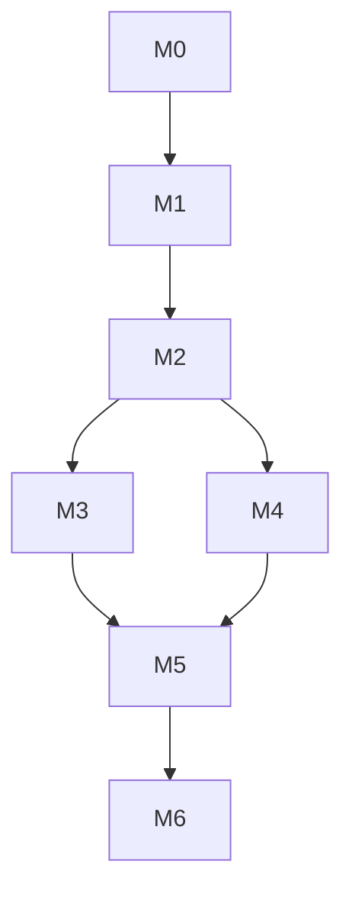

# Promfter Maker 로드맵

작성일: 2026-07-14  
기준 버전: v0.3

---

## 01. 목표 타임라인 (로컬 · 상대)

| 단계 | 이름 | 목표 | 상태 |
|---|---|---|---|
| M0 | 문서·디자인 고정 | PRD·스펙·아키텍처·스토리보드·로드맵·작업지시서 · Stitch 시안 · Outline | 진행/완료 |
| M1 | UI 셸 | Stitch 메인·설정 레이아웃 + SVIL 토큰·로컬 폰트 | 예정 |
| M2 | 변환 | DeepSeek V4 Flash 변환 · 상태 라벨 · 최종 편집 | 예정 |
| M3 | 히스토리·카테고리 | 영속 저장 · 제목 · CRUD · 시드 5종 | 예정 |
| M4 | 번역·복사 | 영문 번역 · 클립보드 · 오류 처리 | 예정 |
| M5 | 설정·i18n·a11y | 글꼴 8종(실재) · S/M/L · 5언어 · 접근성 검증 | 예정 |
| M6 | 패키징(선택) | 데스크톱 셸 · 설치 스크립트 | 후속 |

---

## 02. 마일스톤 상세

### M0 — 문서·디자인

- [x] PRD v0.3  
- [x] Stitch zip 반영  
- [ ] 스펙·아키텍처·스토리보드·로드맵·작업지시서 · Outline 동기화  

### M1 — UI 셸

- 메인/설정 정적 구현 (더미 데이터)  
- 토큰 CSS · 50px · 포커스 링  
- CDN 제거  

### M2 — 변환

- DeepSeek 클라이언트  
- 카테고리별 system prompt  
- `변환 중/완료/실패`  

### M3 — 히스토리·카테고리

- localStorage 영속  
- 제목 인라인  
- 추가/삭제·최소 1개  

### M4 — 번역·복사

- 번역 API  
- 복사 피드백  

### M5 — 설정·품질

- SVIL 화면 설정 표준  
- 대비·키보드·reduced-motion 점검  

### M6 — 후속

- Electron/Tauri  
- 히스토리 검색·상한  
- ComfyUI 연동 검토  

---

## 03. 의존 관계

M3와 M4는 M2 이후 병렬 가능.

---

## 04. 완료 정의 (릴리스 후보)

- PRD 성공 기준 S1–S8 충족  
- Stitch 대비 주요 영역 육안 일치 + SVIL 폰트/토큰 적용  
- Outline 문서와 로컬 `docs/outline-wiki/` 동기화
