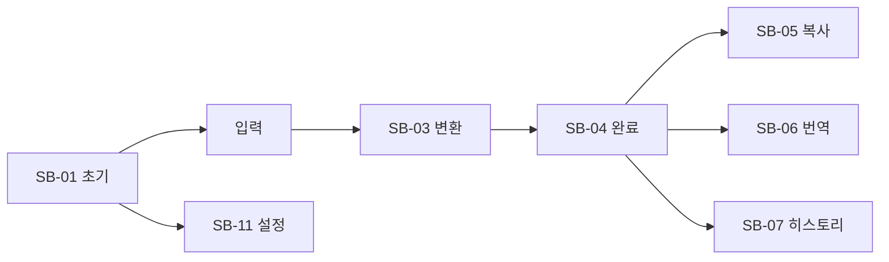

# Promfter Maker 스토리보드

작성일: 2026-07-14  
기준 버전: v0.3  
시각 기준: Stitch `promfter_maker_main_screen` / `promfter_maker_settings_panel`

---

## 01. 화면 목록

| ID | 화면 | 설명 |
|---|---|---|
| SB-01 | 메인 초기 | 빈 입력 · 시드 카테고리 · 히스토리 비어 있거나 샘플 |
| SB-02 | 카테고리 전환 | 탭 선택 · underline accent |
| SB-03 | 변환 중 | 입력 유지 · `변환 중` 라벨 · 버튼 비활성 |
| SB-04 | 변환 완료 | 최종 프롬프트 채움 · 히스토리 신규 행 |
| SB-05 | 복사 완료 | `복사됨` 피드백 |
| SB-06 | 번역 중/완료 | 영문 결과 표시 · `번역 중`/`완료` |
| SB-07 | 히스토리 복원 | 행 클릭 → 입력·최종 복원 |
| SB-08 | 제목 편집 | 인라인 제목 수정 · 포커스 링 |
| SB-09 | 카테고리 추가 | 이름 입력 → 탭 추가 |
| SB-10 | 카테고리 삭제 | 확인 다이얼로그 → 최소 1개 가드 |
| SB-11 | 설정 모달 | 글꼴·크기·언어·API 키 |
| SB-12 | 오류 | API/키 오류 · `실패` + 메시지 · 기존 결과 유지 |

---

## 02. 메인 플로우

---

## 03. 컷별 상세

### SB-01 메인 초기

- 좌측: History / Settings / Help  
- 브랜드: Promfter Maker  
- 탭: General 선택  
- 입력 placeholder: 아이디어를 입력하세요  
- 변환 버튼 활성(클릭 시 빈값 안내)  
- 최종·히스토리: 빈 상태 또는 안내 문구

### SB-02 카테고리 전환

- 탭 클릭 → 선택 탭 `text-secondary` + 3px underline `#7ec8ff`  
- 이후 변환에 해당 시스템 프롬프트 사용

### SB-03~04 변환

- 라벨 `변환 중` (색만 사용 금지)  
- 완료 시 최종 영역 채움 · History 상단에 제목(자동)·카테고리 칩·타임스탬프(Consolas)

### SB-05~06 복사·번역

- 복사: 토스트/인라인 `복사됨`  
- 번역: `번역 중` → 영문 표시 · 원문(최종) 유지

### SB-07~08 히스토리

- 행 클릭 복원  
- 제목 필드 포커스 시 `#ffd479` 링 · 저장은 blur/Enter

### SB-09~10 카테고리 CRUD

- +: 이름 입력 후 탭 append  
- 삭제: 확인 · 마지막 1개면 `카테고리는 최소 1개 필요합니다` 라벨

### SB-11 설정

- Stitch 모달 레이아웃  
- 저장 시 즉시 UI 반영 · 초기화는 기본값 복귀(히스토리 삭제 여부는 확인)

### SB-12 오류

- 네트워크/401/타임아웃  
- `변환 실패` / `번역 실패` + 짧은 사유  
- 입력·기존 최종문 유지

---

## 04. 시안 매핑

| 스토리보드 | Stitch 파일 |
|---|---|
| SB-01~10, 12 | `promfter_maker_main_screen/screen.png` + `code.html` |
| SB-11 | `promfter_maker_settings_panel/screen.png` + `code.html` |

구현 시 CDN 폰트는 교보손글씨2019 등으로 치환 (`design/README.md`).
